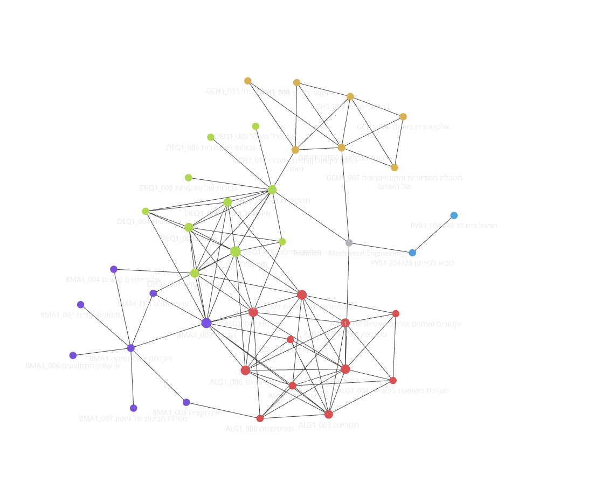
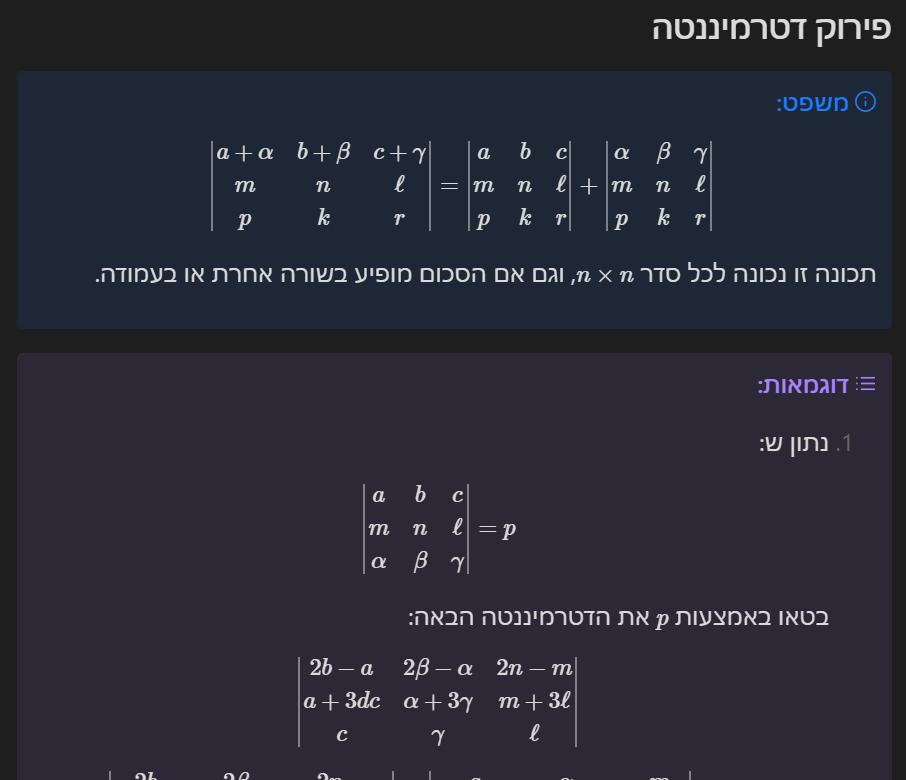
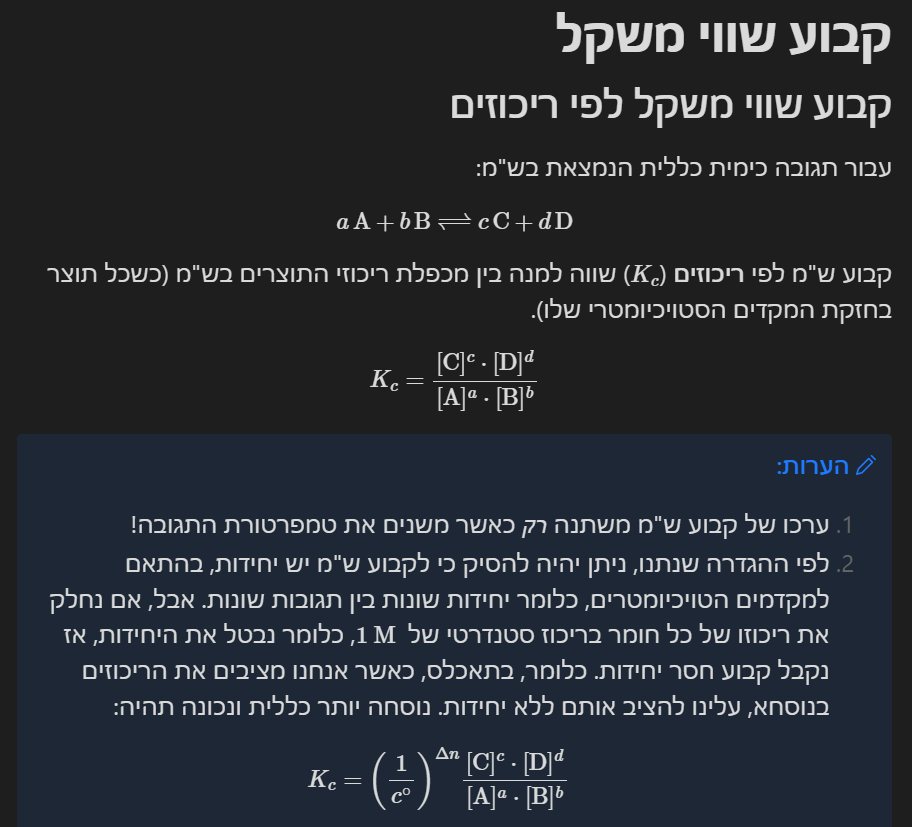

### תקופת מבחנים? כנראה האתר [עלה](https://publish.obsidian.md/technion-second-brain/Technion/TECHNION/TECHNION_000)

### קישור להורדה של הגרסא האחרונה: [הורדה](https://github.com/NuclearGandhi/Technion_Second_Brain/archive/refs/heads/master.zip)

ניתן לראות מתי היה העדכון האחרון ומה היו השינויים [כאן](https://github.com/NuclearGandhi/technion_second_brain/commits/master).

# הקדמה
תיקייה זו היא אוסף כלל הסיכומים שלי בנושאים שונים. אפשר להתייחס לזה כמו מחברת אחת ענקית שמכילה תתי מחברות, אבל תאכלס זה פשוט תיקיות תחת תיקיות תחת תיקיות תחת תיקיות...

אז מה זה בעצם המחברת הזו? אפשר לחשוב על זה כמו ויקיפדיה, כשבכל עמוד יש לי קישורים להגדרות, משפטים ומסקנות מעמודים שונים ככה שבסוף נוצרת רשת שמקשרת בין כלל הנושאים:

ברוב הנושאים קשה לי להבין מה לעזאזל המרצה התכוון כשהוא מתחיל למלמל לעצמו מילים כמו ווירשטאסט, לגרנג', קלאוזיוס-קליפרון, אינטגרביליות וכו'. אז פרשתי לצנזור וסיכמתי לעצמי בשפה שאני מבין, ובתקווה, אולי גם אתם תבינו.
כל אחד חופשי לקחת את מה שיש פה ולהרחיב ולשנות כרצונו.

דוגמאות לפורמט הסיכום:

ישנם נושאים שבהם לא הרחבתי יותר מאשר המרצה, ואולי אפילו אין שום דוגמאות או תרגילים. אילו כנראה נושאים שבהם לא היה לי כוח לסכם, או, וזה בסבירות יותר גבוהה - שלא התחלתי להקליד ולהשתמש בשיטת סיכום זו כשלימדו את החומר. זה למה רוב הסיכומים היותר טובים יהיו לקראת סוף סמסטר א'.

### שימו לב!
אוסף זה של מחברות עלול להכיל שגיאות. הוא אוסף של סיכומים שאני כותב לעצמי - מטרתו היא לא לאסוף מידע אקדמי לציבור הרחב. לכן, אין להתייחס אליו כמו ספר אקדמי.
בנוסף, שימו לב כי המחברת הזאת תמיד מתעדכנת.

---

המחברת הזו היא תוצר של המוןןןןןן שעות עבודה, אז אשמח אם:

# הוראות שימוש
ישנן שתי דרכים להשתמש במחברת זו. כך או כך בשביל שתיהן כדאי להתקין את תוכנת [Obsidian](https://obsidian.md/), מהסיבה הפשוטה שלמרות שרוב התוכן רשום ב-Markdown, הוא לא כל כך קריא ב-GitHub.

אם אתם מכירים git ואת GitHub, סומך עליכם שתדעו איך להוריד את מחברת זו. אם לא, ממליץ לכם לעשות את הדבר הבא:
- הורידו את [המחברת](https://github.com/NuclearGandhi/Technion_Second_Brain/archive/refs/heads/master.zip), ושימו את תוכן ה-zip במקום לבחירתכם.
- אחרי שמתקינים את התוכנה, פותחים `Vault` חדש, ומכוונים אותו למקום בו שמרתם את המחברת שהורדתם.
- אם אתם רואים דף ריק, או פשוט הודעה שאומרת `No file is open`, אל תדאגו. בפינה השמאלית למעלה יש כפתור שיפתח לכם כרטיסייה שמאלית, ושם יהיו כל הקבצים והתיקיות תחתיהם, שהם הסיכומים עצמם.
- אם אתם מעוניינים ברק לקרוא את הסיכומים, ולא לשנות/להרחיב, תלחצו על האייקון של הספר בצד ימין למעלה - הוא יעביר אתכם ל-Reading View. כדאי לכם גם לשנות את השיטת תצוגה הזו לברירת מחדל, אז כנסו להגדרות (אייקון של גלגל שיניים בצד שמאל למטה), שמה תוכלו להגדיר את זה ועוד המון כלים עיצוביים אחרים לטעמכם.
- כל פעם שתרצו לעדכן לגרסא האחרונה של המחברת, אתם לא חייבים לחזור לאתר הזה, כי העתק מלא של כל הקובץ שאתם קוראים עכשיו נמצא גם במחברת - הוא נקרא README (הקובץ, לא התיקייה), ושם יש לינק להורדת הגרסא האחרונה.

ל-Obsidian יש גם אפליקצייה ל-iOS ול-Android, אז אתם יכולים גם להשתמש בסיכומים בטבלט שלכם, שזה איך אני מקליד את רוב הסיכומים בזמן ההרצאות.
