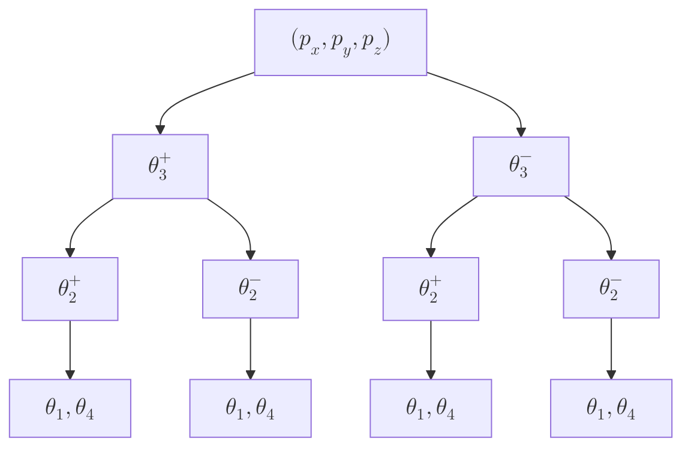

---
aliases:
---
## שאלה 1
### סעיף א'

![[IRB1_E2020WA 2020 חורף מועד א 2025-07-14 08.25.31.excalidraw.svg]]^figure-1-dh-def
>הגדרת מערכות הצירים לפי D–H.

### סעיף ב'

$$\boxed{\begin{array}{c|ccc}
i & \alpha _{i} & {a}_{i} & {d}_{i} & {\theta}_{i} \\
\hline 1  & 90^{\circ}  & 0 & {\ell}_{0}+{r}_{1}-{d}_{1} & 90^{\circ}  \\
2 & 0 & {L}_{2} &  {r}_{1}+{\ell}_{4} & {\theta}_{2} \\
3 & 90^{\circ}  & 0 & 0 & {\theta}_{3} \\
4 & 0 & {r}_{2} & {d}_{4}+{r}_{2}+{\ell}_{5} & 0
\end{array} }$$
כאשר ${L}_{2}=\sqrt{ {{{\ell}_{2}}}^{2}+({\ell}_{1}+{\ell}_{3})^{2} }$.

לפי [[IRB1_002 Forward Kinematics|משוואה]] $\text{(LP14.5)}$:
$$^{i-1}\mathbf{T}_i = \begin{pmatrix}
\cos\theta_i & -\sin\theta_i\cos\alpha_i & \sin\theta_i\sin\alpha_i & a_i\cos\theta_i \\
\sin\theta_i & \cos\theta_i\cos\alpha_i & -\cos\theta_i\sin\alpha_i & a_i\sin\theta_i \\
0 & \sin\alpha_i & \cos\alpha_i & d_i \\
0 & 0 & 0 & 1
\end{pmatrix}$$

לכן:
$$\small\begin{aligned}
 & ^{0}\mathbf{T}_{1}=\begin{pmatrix}
0 & 0 & 1 & 0 \\
1 & 0 & 0 & 0 \\
0 & 1 & 0 & {\ell}_{0}+{r}_{1}-{d}_{1} \\
0 & 0 & 0 & 1
\end{pmatrix}, &  & ^{1}\mathbf{T}_{2}=\begin{pmatrix}
{c}_{2} & -{s}_{2} & 0 & {L}_{2}{c}_{2} \\
{s}_{2} & {c}_{2} & 0 & {L}_{2}{s}_{2} \\
0 & 0 & 1 & {r}_{1}+{\ell}_{4} \\
0 & 0 & 0 & 1
\end{pmatrix} \\[3ex]
 & ^{2}\mathbf{T}_{3}=\begin{pmatrix}
{c}_{3} & 0 & {s}_{3} & 0 \\
{s}_{3} & 0 & -{c}_{3} & 0 \\
0 & 1 & 0 & 0 \\
0 & 0 & 0 & 1
\end{pmatrix}, &  & ^{3}\mathbf{T}_{4}=\begin{pmatrix}
1 & 0 & 0 & {r}_{2} \\
0 & 1 & 0 & 0 \\
0 & 0 & 1 & {d}_{4}+{r}_{2}+{\ell}_{5} \\
0 & 0 & 0 & 1
\end{pmatrix}
\end{aligned}$$

### סעיף ג'
$$\boxed {
^{0}\mathbf{T}_{4}=\,^{0}{{\mathbf{T}_{1}}}^{1}{{\mathbf{T}_{2}}}^{2}{{\mathbf{T}_{3}}} ^{3}\mathbf{T}_{4}
 }$$

## שאלה 2
%%![[IRB1_E2020WA 2020 חורף מועד א 2025-07-14 09.24.40.excalidraw.svg]]%%

נתון:
$$\mathbf{p}_{4}=\begin{pmatrix}
{\ell}_{1}{c}_{1}+{\ell}_{2}{c}_{12}+{\ell}_{3}{c}_{12}{s}_{3} \\
{\ell}_{1}{s}_{1}+{\ell}_{2}{s}_{12}+{\ell}_{3}{s}_{12}{s}_{3} \\
{\ell}_{0}-{\ell}_{3}{c}_{3}
\end{pmatrix}$$
### סעיף א'
מאחר ולרובוט הנתון ישנם $4$ מפרקים, יש לנו $4$ נעלמים, עם $3$ משוואות. לפיכך, לבעיה מספר אינסופי של פתרונות (ממד $1$).

### סעיף ב'
המשוואות שלנו הן:
$$\begin{aligned}
 & {p}_{x}={\ell}_{1}{c}_{1}+{\ell}_{2}{c}_{12}+{\ell}_{3}{c}_{12}{s}_{3} \\
 & {p}_{y}={\ell}_{1}{s}_{1}+{\ell}_{2}{s}_{12}+{\ell}_{3}{s}_{12}{s}_{3} \\
 & {p}_{z}={\ell}_{0}-{\ell}_{3}{c}_{3}
\end{aligned}$$
מהמשוואה השלישית:
$${c}_{3}=\dfrac{{\ell}_{0}-{p}_{z}}{{\ell}_{3}}$$
נזכור כי ${s}_{3}=\pm\sqrt{ 1-{{{c}_{3}}}^{2} }$, כך שנוכל לרשום:
$$\boxed{{\theta}_{3}=\mathrm{atan2}(\pm {s}_{3},{c}_{3}) }$$

נעלה בריבוע את המשוואה הראשונה והשנייה ונחבר אותם:
$$\begin{aligned}
{{{p}_{x}}}^{2}+{{{p}_{y}}}^{2} & =2{\ell}_{1}{c}_{1}{\ell}_{2}{c}_{12} +2{\ell}_{2}{c}_{12}{\ell}_{3}{c}_{12}{s}_{3} 
  +2{\ell}_{1}{c}_{1}{\ell}_{3}{c}_{12}{s}_{3} \\[1ex]
 & \qquad\qquad  +{{{\ell}_{1}}}^{2}+{{{\ell}_{2}}}^{2}+{{{\ell}_{3}}}^{2}{{{s}_{3}}}^{2} \\[1ex]
 &\qquad +2{\ell}_{1}{s}_{1}{\ell}_{2}{s}_{12}+2{\ell}_{2}{s}_{12}{\ell}_{3}{s}_{12}{s}_{3}+2{\ell}_{1}{s}_{1}{\ell}_{3}{s}_{12}{s}_{3}\\[1ex]

\end{aligned}$$
נסמן $L^{2}={{{\ell}_{1}}}^{2}+{{{\ell}_{2}}}^{2}+{{{\ell}_{3}}}^{2}{{{s}_{3}}}^{2}$. לאחר סידור:
$$\begin{gathered}
{{{p}_{x}}}^{2}+{{{p}_{y}}}^{2}=2{\ell}_{1}{\ell}_{2}({c}_{1}{c}_{12}+{s}_{1}{s}_{12})+2{\ell}_{2}{\ell}_{3}{s}_{3}+2{\ell}_{1}{\ell}_{3}{s}_{3}({c}_{1}{c}_{12}+{s}_{1}{s}_{12})+L^{2} \\[1ex]
{{{p}_{x}}}^{2}+{{{p}_{y}}}^{2}=2({\ell}_{1}{\ell}_{2}+{\ell}_{1}{\ell}_{3}{s}_{3})({c}_{1}{c}_{12}+{s}_{1}{s}_{12})+2{\ell}_{2}{\ell}_{3}{s}_{3}+L^{2}
\end{gathered}$$
לפי [[BMA1_009 זהויות טריגונומטריות#חיבור וחיסור זוויות|זהויות טריגונומטריות]]:
$$\begin{gathered}
{{{p}_{x}}}^{2}+{{{p}_{y}}}^{2}=2({\ell}_{1}{\ell}_{2}+{\ell}_{1}{\ell}_{3}{s}_{3}){c}_{2}+2{\ell}_{2}{\ell}_{3}{s}_{3} +L^{2}\\[1ex]
{c}_{2}=\dfrac{{{{p}_{x}}}^{2}+{{{p}_{y}}}^{2}-2{\ell}_{2}{\ell}_{3}{s}_{3}-L^{2}}{2({\ell}_{1}{\ell}_{2}+{\ell}_{1}{\ell}_{3}{s}_{3})}
\end{gathered}$$
נזכור כי ${s}_{2}=\pm\sqrt{ 1-{{{c}_{2}}}^{2} }$, ולכן:
$$\boxed{{\theta}_{2}=\mathrm{atan2}(\pm {s}_{2},{c}_{2}) }$$

נרצה כעת לרשות את שתי המשוואות הראשונות כמערכת משוואות עם ${s}_{1}$ ו-${c}_{1}$ כנעלמים. לפי אותם זהויות, ניתן לרשום את שתי המשוואות הראשונות כ:
$$\begin{aligned}
 & {p}_{x}={\ell}_{1}{c}_{1}+{\ell}_{2}({c}_{1}{c}_{2}-{s}_{1}{s}_{2})+{\ell}_{3}{s}_{3}({c}_{1}{c}_{2}-{s}_{1}{s}_{2}) \\[1ex]
 & {p}_{y}={\ell}_{1}{s}_{1}+{\ell}_{2}({c}_{1}{s}_{2}+{s}_{1}{c}_{2})+{\ell}_{3}{s}_{3}({c}_{1}{s}_{2}+{s}_{1}{c}_{2})
\end{aligned}$$
לאחר סידור:
$$\begin{aligned}
 & {c}_{1}[{\ell}_{1}+{\ell}_{2}{c}_{2}+{\ell}_{3}{s}_{3}{c}_{2}]+{s}_{1}[-{\ell}_{2}{s}_{2}-{\ell}_{3}{s}_{3}{s}_{2}]={p}_{x} \\[1ex]
 & {c}_{1}[{\ell}_{2}{s}_{2}+{\ell}_{3}{s}_{2}{s}_{3}]+{s}_{1}[{\ell}_{1}+{\ell}_{2}{c}_{2}+{\ell}_{3}{s}_{3}{c}_{2}]={p}_{y}
\end{aligned}$$
מטריצית:
$$\begin{pmatrix}
{\ell}_{1}+{\ell}_{2}{c}_{2}+{\ell}_{3}{s}_{3}{c}_{2} & -{\ell}_{2}{s}_{2}-{\ell}_{3}{s}_{3}{s}_{2} \\
{\ell}_{2}{s}_{2}+{\ell}_{3}{s}_{2}{s}_{3} & {\ell}_{1}+{\ell}_{2}{c}_{2}+{\ell}_{3}{s}_{3}{c}_{2}
\end{pmatrix}\begin{pmatrix}
{c}_{1} \\
{s}_{1}
\end{pmatrix}=\begin{pmatrix}
{p}_{x} \\
{p}_{y}
\end{pmatrix}$$

נסמן:
$$\begin{aligned}
A &= {\ell}_{1}+{\ell}_{2}{c}_{2}+{\ell}_{3}{s}_{3}{c}_{2} \\[1ex]
B &= {\ell}_{2}{s}_{2}+{\ell}_{3}{s}_{2}{s}_{3}
\end{aligned}$$

אז המטריצה הופכת ל:
$$\begin{pmatrix}
A & -B \\
B & A
\end{pmatrix}\begin{pmatrix}
{c}_{1} \\
{s}_{1}
\end{pmatrix}=\begin{pmatrix}
{p}_{x} \\
{p}_{y}
\end{pmatrix}$$

ההופכי של המטריצה הוא:
$$\dfrac{1}{A^{2}+B^{2}}\begin{pmatrix}
A & B \\
-B & A
\end{pmatrix}$$

לכן:
$$\begin{aligned}
{c}_{1} &= \dfrac{A{p}_{x}+B{p}_{y}}{A^{2}+B^{2}} \\[1ex]
{s}_{1} &= \dfrac{A{p}_{y}-B{p}_{x}}{A^{2}+B^{2}}
\end{aligned}$$

ולבסוף:
$$\boxed{{\theta}_{1}=\mathrm{atan2}({s}_{1},{c}_{1}) }$$

### סעיף ג'
מאחר ויש לנו $4$ מפרקים עם $3$ אילוצים בלבד, ${\theta}_{4}$ יכול להיבחר באופן חופשי.

ישנם 4 פתרונות דיסקרטיים לבעיה, בהתאם לבחירת הסימנים השונים:

## שאלה 3
נתון:
$$\mathbf{p}_{3}=\begin{pmatrix}
-{\ell}_{2}{s}_{1}+{d}_{3}{c}_{1}{s}_{2} \\
{\ell}_{2}{c}_{1}+{d}_{3}{s}_{1}{s}_{2} \\
{\ell}_{1}-{d}_{3}{c}_{2}
\end{pmatrix}$$

### סעיף א'
נחשב את היעקוביאן הלינארי ע"י [[IRB1_004 Velocity Kinematics and Statics#Linear Jacobian Computation - Shortcut|גזירה]]:
$$\mathbf{J}_{L}=\begin{pmatrix}
-{\ell}_{2}{c}_{1}-{d}_{3}{s}_{1}{s}_{2} & {d}_{3}{c}_{1}{c}_{2} & {c}_{1}{s}_{2} \\
-{\ell}_{2}{s}_{1}+{d}_{3}{c}_{1}{s}_{2} & {d}_{3}{s}_{1}{c}_{2} & {s}_{1}{s}_{2} \\
0 & {d}_{3}{s}_{2} & -{c}_{2}
\end{pmatrix}$$
נשים לב גם ש:
$$\begin{aligned}
\mathbf{J}_{A} & =\begin{pmatrix}
\mathbf{z}_{0} & \mathbf{z}_{1} & 0
\end{pmatrix} \\[1ex]
 & =\begin{pmatrix}
0 & -{s}_{1} & 0 \\
0  & {c}_{1} & 0\\
1 & 0 & 0
\end{pmatrix}
\end{aligned}$$

נסכם:
$$\boxed{\mathbf{J} =\begin{pmatrix}
-{\ell}_{2}{c}_{1}-{d}_{3}{s}_{1}{s}_{2} & {d}_{3}{c}_{1}{c}_{2} & {c}_{1}{s}_{2} \\
-{\ell}_{2}{s}_{1}+{d}_{3}{c}_{1}{s}_{2} & {d}_{3}{s}_{1}{c}_{2} & {s}_{1}{s}_{2} \\
0 & {d}_{3}{s}_{2} & -{c}_{2} \\
0 & -{s}_{1} & 0 \\
0 & {c}_{1} & 0 \\
1 & 0 & 0
\end{pmatrix}}$$

### סעיף ב'
נחשב את הדטרמיננטה של היעקוביאן הלינארי:
$$\begin{aligned}
\det(\mathbf{J}_{L}) & =-{d}_{3}{s}_{2}[{s}_{1}{s}_{2}(-{\ell}_{2}{c}_{1}-{d}_{3}{s}_{1}{s}_{2})-{c}_{1}{s}_{2}(-{\ell}_{2}{s}_{1}+{d}_{3}{c}_{1}{s}_{2})] \\[1ex]
 & \qquad -{c}_{2}[{d}_{3}{s}_{1}{c}_{2}(-{\ell}_{2}{c}_{1}-{d}_{3}{s}_{1}{s}_{2})-{d}_{3}{c}_{1}{c}_{2}(-{\ell}_{2}{s}_{1}+{d}_{3}{c}_{1}{s}_{2})] \\[1ex]
 & =-{d}_{3}{{{s}_{2}}}^{2}[-{\ell}_{2}{c}_{1}{s}_{1}-{d}_{3}{{{s}_{1}}}^{2}{s}_{2}+{\ell}_{2}{c}_{1}{s}_{1}-{d}_{3}{{{c}_{1}}}^{2}{s}_{2}] \\[1ex]
 & \qquad -{{{c}_{2}}}^{2}[-{\ell}_{2}{d}_{3}{c}_{1}{s}_{1}-{{{d}_{3}}}^{2}{{{s}_{1}}}^{2}{s}_{2}+{d}_{3}{\ell}_{2}{c}_{1}{s}_{1}-{{{d}_{3}}}^{2}{{{c}_{1}}}^{2}{s}_{2}] \\[1ex]
 & =-{d}_{3}{{{s}_{2}}}^{3}[-{d}_{3}]-{{{c}_{2}}}^{2}{s}_{2}[-{{{d}_{3}}}^{2}] \\[1ex]
 & ={{{d}_{3}}}^{2}{s}_{2}[{{{s}_{2}}}^{2}+{{{c}_{2}}}^{2}] \\[1ex]
 & ={{{d}_{3}}}^{2}{s}_{2}
\end{aligned}$$
לכן נקבל סינגולריות כאשר $\boxed{{\theta}_{2}=0,\pi }$ או $\boxed{{d}_{3}=0 }$.

אין לי כוח לצייר.

## שאלה 3
### סעיף א'
![[IRB1_E2020WA 2020 חורף מועד א 2025-07-14 20.03.54.excalidraw.svg]]^figure-3a
>מרחב העבודה ללא מגבלות על המפרקים הסיבוביים.
### סעיף ב'
![[IRB1_E2020WA 2020 חורף מועד א 2025-07-14 20.22.35.excalidraw.svg]]^figure-3b
>אין לי שמץ, ניסיתי דברים.