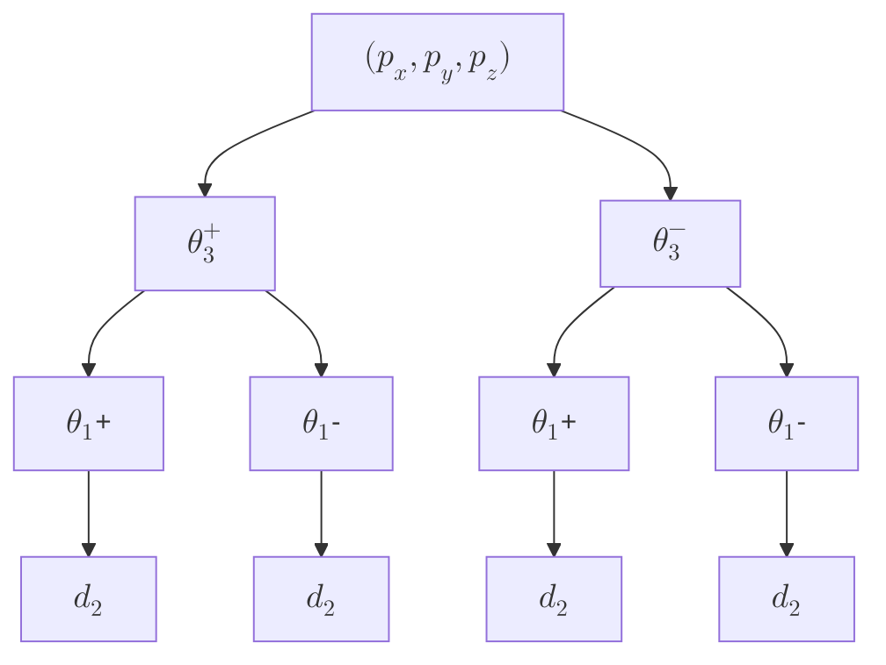

---
aliases:
---
## שאלה 1

### סעיף א'
![[IRB1_E2022WA 2022 חורף מועד א 2025-07-12 11.28.02.excalidraw.svg]]^figure-q1-axes
>הגדרת מערכות צירים לפי D–H.

### סעיף ב'
$$\boxed {
\begin{array}{c|cccc}
i & \alpha _{i} & {a}_{i} & {d}_{i} & {\theta}_{i} \\
\hline 1 & -90^{\circ} & {L}_{2} & {L}_{1} & {\theta}_{1} \\
2 & -90^{\circ}  & {L}_{5} & {L}_{3} & {\theta}_{2} \\
3 & 0 & 0 & {L}_{4}+{d}_{3} & 0
\end{array}
 }$$

### סעיף ג'
לפי [[IRB1_002 Forward Kinematics|משוואה]] $\text{(LP14.5)}$:
$$^{i-1}\mathbf{T}_i = \begin{pmatrix}
\cos\theta_i & -\sin\theta_i\cos\alpha_i & \sin\theta_i\sin\alpha_i & a_i\cos\theta_i \\
\sin\theta_i & \cos\theta_i\cos\alpha_i & -\cos\theta_i\sin\alpha_i & a_i\sin\theta_i \\
0 & \sin\alpha_i & \cos\alpha_i & d_i \\
0 & 0 & 0 & 1
\end{pmatrix}$$

לכן:
$$\small\begin{aligned}
 & ^{0}\mathbf{T}_{1}=\begin{pmatrix}
{c}_{1} & 0 & -{s}_{1} & {L}_{2}{c}_{1} \\
{s}_{1} & 0 & {c}_{1} & {L}_{2}{s}_{1} \\
0 & -1 & 0 & {L}_{1} \\
0 & 0 & 0 & 1
\end{pmatrix}, &  & ^{1}\mathbf{T}_{2}=\begin{pmatrix}
{c}_{2} & 0 & -{s}_{2} & {L}_{5}{c}_{2} \\
{s}_{2} & 0 & {c}_{2} & {L}_{5}{s}_{2} \\
0 & -1 & 0 & {L}_{3} \\
0 & 0 & 0 & 1
\end{pmatrix} \\[1ex]
 & ^{2}\mathbf{T}_{3}=\begin{pmatrix}
1 & 0 & 0 & 0 \\
0 & 1 & 0 & 0 \\
0 & 0 & 1 & {L}_{4}+{d}_{3} \\
0 & 0 & 0 & 1
\end{pmatrix}
\end{aligned}$$

כך ש:
$$\boxed {
^{0}\mathbf{T}_{3}=\,^{0}{{\mathbf{T}_{1}}}^{1}{{\mathbf{T}_{2}}}^{2}{{\mathbf{T}_{3}}}
 }$$

### סעיף ד'

נתון כי כעת מותקן מברג בתפסנית. מיקום קצה המברג במערכת התפסנית הוא $({p}_{x},{p}_{y},{p}_{z}) = (0,5,10)$.

מיקום קצה המברג במערכת העולם הוא:
$${}^{0}\mathbf{p} = {}^{0}\mathbf{T}_{3} \begin{pmatrix} 0 \\ 5 \\ 10 \\ 1 \end{pmatrix}$$

## שאלה 2
![[IRB1_E2022WA 2022 חורף מועד א 2025-07-12 13.29.57.excalidraw.svg]]^figure-2-assigning-DH
>הגדרת מערכת הצירים.

### סעיף א'
נתונה נקודת הדרישה $P=({p}_{x},{p}_{y},{p}_{z})$.

ישנם שלושה משתנים ושלושה מפרקים, כך שממד קבוצת הפתרונות הוא מספר דיסקרטי.

### סעיף ב'
ניתן לראות מבחירת מערכת הצירים שלנו ש:
$$\begin{aligned}
 & {p}_{x}={s}_{1}({d}_{2}+2{L}_{2}{c}_{3}) \\[1ex]
 & {p}_{y}={c}_{1}({d}_{2}+2{L}_{2}{c}_{3}) \\[1ex]
 & {p}_{z}={L}_{1}+2{L}_{2}{s}_{3}
\end{aligned}$$
מהמשוואה השלישית:
$${s}_{3}=\dfrac{{p}_{z}-{L}_{1}}{2{L}_{2}}$$

**פתרון עבור ${\theta}_{3}$:**
מהמשוואה השלישית:
$$\begin{gathered}
{s}_{3}=\dfrac{{p}_{z}-{L}_{1}}{2{L}_{2}} \\[1ex]
\end{gathered}$$
ולכן:
$${c}_{3}=\pm\sqrt{ 1-\left(\dfrac{{p}_{z}-{L}_{1}}{2{L}_{2}}\right)^{2} } $$

נרשום:
$$\boxed{{\theta}_{3}=\mathrm{atan2}({s}_{3},\pm {c}_{3}) }$$

**פתרון עבור ${d}_{2}$ ו-${\theta}_{1}$:**
נגדיר: $r_\mathrm{} = {d}_{2}+2{L}_{2}{c}_{3}$.

מהמשוואות הראשונה והשנייה:
$$\begin{aligned}
 & {p}_{x}=r_\mathrm{}{s}_{1} \\
 & {p}_{y}=r_\mathrm{}{c}_{1}
\end{aligned}$$

נעלה בריבוע ונחבר:
$${{{p}_{x}}}^{2}+{{{p}_{y}}}^{2}={r}^{2}$$

מכאן:
$${r_\mathrm{}}=\pm\sqrt{{{{p}_{x}}}^{2}+{{{p}_{y}}}^{2}}$$

לכן:
$$\boxed {
\begin{aligned}
{d}_{2} & =\pm\sqrt{{{{p}_{x}}}^{2}+{{{p}_{y}}}^{2}} - 2{L}_{2}{c}_{3} \\[1ex]
{\theta}_{1} & =\mathrm{atan2}(\pm {p}_{y},\pm {p}_{x})
\end{aligned}
 }$$

### סעיף ג'

ישנם 4 פתרונות לבעיה באופן כללי, בהנחה שאין אילוצים מגבילים על ${d}_{2}$ (כגון אם הוא יכול להיות שלילי).

עץ הפתרונות:

## שאלה 3
נתון:
$$\small\begin{aligned}
 & ^{0}\mathbf{T}_{1}=\begin{pmatrix}
1 & 0 & 0 & 0 \\
0 & 1 & 0 & 0 \\
0 & 0 & 1 & {d}_{1} \\
0 & 0 & 0 & 1
\end{pmatrix}, &  & ^{1}\mathbf{T}_{2}=\begin{pmatrix}
{c}_{2} & 0 & {s}_{2} & 0 \\
{s}_{2} & 0 & -{c}_{2} & 0 \\
0 & 1 & 0 & {d}_{1}+h \\
0 & 0 & 0 & 1
\end{pmatrix} \\[3ex]
 & ^{0}\mathbf{T}_{3}=\begin{pmatrix}
{c}_{2}{c}_{3} & -{c}_{2}{s}_{3} & {s}_{2} & e{c}_{2}{c}_{3} \\
{s}_{2}{c}_{3} & -{s}_{2}{s}_{3} & -{c}_{2} & e{s}_{2}{c}_{3} \\
{s}_{3} & {c}_{3} & 0 & {d}_{1}+h+e{s}_{3} \\
0 & 0 & 0 & 1
\end{pmatrix}
\end{aligned}$$
### סעיף א'
נחשב את היעקוביאן הלינארי ע"י [[IRB1_004 Velocity Kinematics and Statics#Linear Jacobian Computation - Shortcut|גזירה]] של $\mathbf{p}_{3}=\begin{pmatrix}e{c}_{2}{c}_{3} & e{s}_{2}{c}_{3} & {d}_{1}+h+e{s}_{3}\end{pmatrix}^{T}$:
$$\begin{aligned}
\mathbf{J}_{L} & =\dfrac{ \partial \mathbf{p}_{3} }{ \partial \boldsymbol{\theta} }  \\[1ex]
 & =\begin{pmatrix}
0 & -e{s}_{2}{c}_{3} & -e{c}_{2}{s}_{3} \\
0 & e{c}_{2}{c}_{3} & -e{s}_{2}{s}_{3} \\
1 & 0 & e{c}_{3}
\end{pmatrix}
\end{aligned}$$
היעקוביאן הזוויתי:
$$\begin{aligned}
\mathbf{J}_{A} & =\begin{pmatrix}
0 & \mathbf{z}_{1} & \mathbf{z}_{2}
\end{pmatrix} \\[1ex]
 & =\begin{pmatrix}
0 & 0 & {s}_{2} \\
0 & 0 & -{c}_{2} \\
0 & 1 & 0
\end{pmatrix}
\end{aligned}$$
לסיכום:
$$\boxed{\mathbf{J}=\begin{pmatrix}
0 & -e{s}_{2}{c}_{3} & -e{c}_{2}{s}_{3} \\
0 & e{c}_{2}{c}_{3} & -e{s}_{2}{s}_{3} \\
1 & 0 & e{c}_{3} \\
0 & 0 & {s}_{2} \\
0 & 0 & -{c}_{2} \\
0 & 1 & 0
\end{pmatrix} }$$

### סעיף ב'
נחשב את הדטרמיננטה של היעקוביאן הלינארי:
$$\begin{aligned}
\det(\mathbf{J}_{L}) & =e^{2}{{{s}_{2}}}^{2}{c}_{3}{s}_{3}+e^{2}{{{c}_{2}}}^{2}{c}_{3}{s}_{3} \\[1ex]
 & =e^{2}{c}_{3}{s}_{3}
\end{aligned}$$
כאשר ביטוי זה מתאפס, היעקוביאן סינגולרי. כלומר, הנקודות הסינגולריות של המערכת הן:
$${\theta}_{3}=0,\dfrac{\pi}{2},\pi,\dfrac{3\pi}{2}$$
### סעיף ג'
נתון כי על הקצה, במערכת צירים $\{ 3 \}$:
$$\boldsymbol{\mathcal{F}}_{\text{tip}}^{(3)}=\begin{pmatrix}
0 \\
0 \\
F
\end{pmatrix},\qquad \boldsymbol{\mathcal{T}}_{\text{tip}}^{(3)}=\begin{pmatrix}
0 \\
0 \\
\tau
\end{pmatrix}$$
נמיר למערכת ציר העולם:
$$\begin{aligned}
\boldsymbol{\mathcal{F}}_{\text{tip}}^{(0)} & =\,^{0}\mathbf{T}_{3}\boldsymbol{\mathcal{F}}_{\text{tip}}^{(3)} \\[1ex]
 & =\begin{pmatrix}
{c}_{2}{c}_{3} & -{c}_{2}{s}_{3} & {s}_{2} \\
{s}_{2}{c}_{3} & -{s}_{2}{s}_{3} & -{c}_{2} \\
{s}_{3} & {c}_{3} & 0
\end{pmatrix}\begin{pmatrix}
0 \\
0 \\
F
\end{pmatrix} \\[1ex]
 & =\begin{pmatrix}
{s}_{2}F\\
-{c}_{2}F \\
0
\end{pmatrix}
\end{aligned}$$
באותו אופן עבור המומנט ניתן להראות ש:
$$\boldsymbol{\mathcal{T}}^{(0)}_{\text{tip}}=\begin{pmatrix}
{s}_{2}\tau \\
-{c}_{2}\tau \\
0
\end{pmatrix}$$
נוכל כעת לחשב את הכוחות המוכללים על המפרקים לפי [[IRB1_004 Velocity Kinematics and Statics#Manipulator Statics|משוואה]] $\text{(LP5.3)}$:
$$\begin{aligned}
\boldsymbol{\tau}_{\text{joints}} & =\mathbf{J}^{T}\mathbf{f}_{\text{tip}} \\[1ex]
 & =\begin{pmatrix}
0 & 0 & 1 & 0 & 0 & 0 \\
-e{s}_{2}{c}_{3} & e{c}_{2}{c}_{3} & 0 & 0 & 0 & 1 \\
-e{c}_{2}{s}_{3} & -e{s}_{2}{s}_{3} & e{c}_{3} & {s}_{2} & -{c}_{2} & 0
\end{pmatrix}\begin{pmatrix}
{s}_{2}F \\
-{c}_{2}F \\
0 \\
{s}_{2}\tau \\
-{c}_{2}\tau \\
0
\end{pmatrix} \\[1ex]
 & =\begin{pmatrix}
0 \\
-e{c}_{3}F \\
\tau
\end{pmatrix}
\end{aligned}$$
נסיק כי הכוחות והמומנטים הפועלים על מפרקי הרובוט הם:
$$\boxed {
\boldsymbol{\tau}_{\text{joints}}=\begin{pmatrix}
0 \\
-e{c}_{3}F \\
\tau
\end{pmatrix}
 }$$

## שאלה 4
![[IRB1_E2022WA 2022 חורף מועד א 2025-07-12 22.49.29.excalidraw.svg]]^figure-4-chosen-manip
>הרובוט שפורש את מרחב העבודה.

מגבלות המפרקים:
$$\boxed {
\begin{gathered}
0<{d}_{1}<\ell \\
0<{\theta}_{2}<\theta \\
r<{d}_{3}<R
\end{gathered}
 }$$