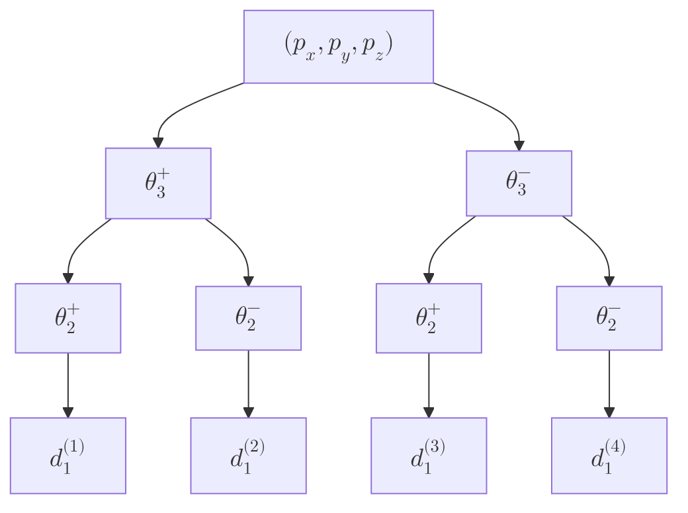

---
aliases:
---
## שאלה 1
![[IRB1_E2023WA 2023 חורף מועד א 2025-07-07 13.20.34.excalidraw.svg]]^figure-q1-given
>הרובוט הנתון בקונפיגורציה מסוימת.

### סעיף א'
נשים לב שבמצב הנתון באיור, לא כל ה-$\theta$-ות בהכרח $0^{\circ}$.

![[IRB1_E2023WA 2023 חורף מועד א 2025-07-07 13.56.45.excalidraw.svg]]^figure-q1-D-H-def
>הגדרת מערכות צירים לפי D–H, בקונפיגורציה בה ${\theta}_{3}=180^{\circ}$.

### סעיף ב'
מהגדרת מערכות הצירים לעיל, נסיק כי:
$$\boxed {
\begin{array}{c|cccc}
i & \alpha _{i} & {a}_{i} & {d}_{i} & {\theta}_{i} \\
\hline 1 & 90^{\circ} & 0 & {\ell}_{1}+{\ell}_{2}/\sqrt{ 2 } & {\theta}_{1} \\
2 & 0 & {\ell}_{3} & {\ell}_{2}/\sqrt{ 2 }+{d}_{2} & 90^{\circ}  \\
3 & 0 & 0 & 0 & {\theta}_{3} \\
4 & 0  & {\ell}_{4} & {d}_{4} &  0
\end{array}
 }$$

### סעיף ג'
לפי [[IRB1_002 Forward Kinematics|משוואה]] $\text{(LP14.5)}$:
$$^{i-1}\mathbf{T}_i = \begin{pmatrix}
\cos\theta_i & -\sin\theta_i\cos\alpha_i & \sin\theta_i\sin\alpha_i & a_i\cos\theta_i \\
\sin\theta_i & \cos\theta_i\cos\alpha_i & -\cos\theta_i\sin\alpha_i & a_i\sin\theta_i \\
0 & \sin\alpha_i & \cos\alpha_i & d_i \\
0 & 0 & 0 & 1
\end{pmatrix}$$

לכן:
$$\small\begin{aligned}
 & ^{0}\mathbf{T}_{1}=\begin{pmatrix}
{c}_{1} & 0 & {s}_{1} & 0 \\
{s}_{1} & 0 & -{c}_{1} & 0 \\
0 & 1 & 0 & {\ell}_{1}+{\ell}_{2}/\sqrt{ 2 } \\
0 & 0 & 0 & 1
\end{pmatrix}, &  & ^{1}\mathbf{T}_{2}=\begin{pmatrix}
0 & -1 & 0 & 0 \\
1 & 0 & 0 & {\ell}_{3} \\
0 & 0 & 1 & {\ell}_{2}/\sqrt{ 2 }+{d}_{2} \\
0 & 0 & 0 & 1
\end{pmatrix} \\[3ex]
 & ^{2}\mathbf{T}_{3}=\begin{pmatrix}
{c}_{3} & -{s}_{3} & 0 & 0 \\
{s}_{3} & {c}_{3} & 0 & 0 \\
0 & 0 & 1 & 0 \\
0 & 0 & 0 & 1
\end{pmatrix}, &  & ^{3}\mathbf{T}_{4}=\begin{pmatrix}
1 & 0 & 0 & {\ell}_{4} \\
0 & 1 & 0 & 0 \\
0 & 0 & 1 & {d}_{4} \\
0 & 0 & 0 & 1
\end{pmatrix}
\end{aligned}$$

כך ש:
$$^{0}\mathbf{T}_{4}=\,^{0}{{\mathbf{T}_{1}}}^{1}{{\mathbf{T}_{2}}}^{2}{{\mathbf{T}_{3}}}^{3}\mathbf{T}_{4}$$

### סעיף ד'
לפי [[#^figure-q1-D-H-def|האיור]], $\boxed{{\theta}_{3}=180^{\circ} }$.

## שאלה 2

![[IRB1_E2023WA 2023 חורף מועד א 2025-07-11 11.49.01.excalidraw.svg]]
^figure-q2-given
>הרובוט הנתון.

נתונה נקודת הדרישה:
$$P=({p}_{x},{p}_{y,}{p}_{z})$$
וגם מיקום התפסנית:
$$\mathbf{d}=\begin{pmatrix}
({\ell}_{2}+{\ell}_{3}{c}_{3}){c}_{2} \\
-{\ell}_{3}{s}_{3} \\
{d}_{1}+({\ell}_{2}+{\ell}_{3}{c}_{3}){s}_{2}
\end{pmatrix}$$
### סעיף א'
יש לנו את מערכת המשוואות:
$$\begin{aligned}
 & {p}_{x}=({\ell}_{2}+{\ell}_{3} {c}_{3}){c}_{2} \\
 & {p}_{y}=-{\ell}_{3}{s}_{3} \\
 & {p}_{z}={d}_{1}+({\ell}_{2}+{\ell}_{3}{c}_{3}){s}_{2}
\end{aligned}$$

**פתרון עבור ${\theta}_{3}$:**
מהמשוואה השנייה:
$$\begin{gathered}
{s}_{3}=-\dfrac{{p}_{y}}{{\ell}_{3}} \\[1ex]
\end{gathered}$$

לפי זהות טריגונומטרית: ${c}_{3}=\pm\sqrt{1-{{{s}_{3}}}^{2}}$, כך ש:
$${c}_{3}=\pm\sqrt{ 1-\left(\dfrac{{p}_{y}}{{\ell}_{3}}\right)^{2} } $$

נרשום:
$$\boxed{{\theta}_{3}=\mathrm{atan2}({s}_{3},\pm {c}_{3}) }$$

**פתרון עבור ${\theta}_{2}$ ו-${d}_{1}$:**
נגדיר: $r = {\ell}_{2}+{\ell}_{3}{c}_{3}$ (אורך הזרוע האפקטיבי)

מהמשוואות הראשונה והשלישית:
$$\begin{aligned}
 & {p}_{x}=r{c}_{2} \\
 & {p}_{z}-{d}_{1}=r{s}_{2}
\end{aligned}$$

נעלה בריבוע ונחבר:
$${{{p}_{x}}}^{2}+({p}_{z}-{d}_{1})^{2}=r^{2}$$

מכאן:
$$({p}_{z}-{d}_{1})^{2}=r^{2}-{{{p}_{x}}}^{2}$$

לכן:
$${p}_{z}-{d}_{1}=\pm\sqrt{r^{2}-{{{p}_{x}}}^{2}}$$

נקבל:
$$\boxed {
\begin{aligned}
{d}_{1} & ={p}_{z}\mp\sqrt{r^{2}-{{{p}_{x}}}^{2}} \\[1ex]
{\theta}_{2} & =\mathrm{atan2}(\pm\sqrt{r^{2}-{{{p}_{x}}}^{2}},{p}_{x})
\end{aligned}
 }$$

**מספר הפתרונות:**
בשל הסימן $\pm$ ב-${c}_{3}$ והסימן $\pm$ ב-${\theta}_{2}$, יש **ארבעה פתרונות אפשריים** לבעיית הקינמטיקה ההפוכה.

## שאלה 3
![[IRB1_E2023WA 2023 חורף מועד א 2025-07-11 15.14.37.excalidraw.svg]]^figure-q3-given-manipulator
>הרובוט הנתון.

>[!notes] הערה: 
> 
> רשמו במבחן ש:
> "הטרנספורמציות הן טרנספורמציות גוף קשיח שלא מתבססות על שיטת D–H".
> 1. מה זאת אומרת??? אז למה לעזאזל נתתם אותם?
> 2. זה נראה כאילו הטרנספורמציות הנתונות **כן** מסתמכות על שיטת D–H, אבל השרטוט בכלל לא.
> 3. bitch wtf.
> 

נתון:
$$\begin{aligned}
 & ^{0}\mathbf{T}_{1}=\begin{pmatrix}
{c}_{1} & -{s}_{1} & 0 & 0 \\
{s}_{1} & {c}_{1} & 0 & 0 \\
0 & 0 & 1 & h \\
0 & 0 & 0 & 1
\end{pmatrix}, \\[1ex]
 & ^{0}\mathbf{T}_{2}=\begin{pmatrix}
{c}_{1} & -{s}_{1} & 0 & {d}_{2}{c}_{1} \\
{s}_{1} & {c}_{1} & 0 & {d}_{2}{s}_{1} \\
0 & 0 & 1 & h \\
0 & 0 & 0 & 1
\end{pmatrix} \\[1ex]
 & ^{0}\mathbf{T}_{3}=\begin{pmatrix}
{c}_{1} & -{s}_{1}{c}_{3} & {s}_{1}{s}_{3} & {c}_{1}(\ell {c}_{3}+{d}_{2}) \\
{s}_{1} & {c}_{1}{c}_{3} & -{c}_{1}{s}_{3} & {s}_{1}(\ell {c}_{3}+{d}_{2}) \\
0 & {s}_{3} & {c}_{3} & \ell {s}_{3}+h \\
0 & 0 & 0 & 1
\end{pmatrix}
\end{aligned}$$

### סעיף א'
כדי לחשב את היעקוביאן נשתמש ב[[IRB1_004 Velocity Kinematics and Statics#Linear Jacobian Computation - Shortcut|קיצור דרך]]. אנו יודעים כי קצה התפסנית:
$$\mathbf{p}_{3}=\begin{pmatrix}
{c}_{1}(\ell {c}_{3}+{d}_{2}) \\
{s}_{1}(\ell {c}_{3}+{d}_{2}) \\
\ell {s}_{3}+h
\end{pmatrix}$$
ולכן היעקוביאן הלינארי:
$$\mathbf{J}_{L }=\dfrac{ \partial \mathbf{p}_{3} }{ \partial \boldsymbol{\theta} } =\begin{pmatrix}
-{s}_{1}(\ell {c}_{3}+{d}_{2}) & {c}_{1} & -\ell{c}_{1}{s}_{3} \\
{c}_{1}(\ell {c}_{3}+{d}_{2}) & {s}_{1} & -\ell {s}_{1}{s}_{3} \\
0 & 0 & \ell
\end{pmatrix}$$
נשים לב גם כי:
$$\begin{aligned}
\mathbf{J}_{A} & =\begin{pmatrix}
\mathbf{z}_{0} & \mathbf{0} & \mathbf{z}_{2}
\end{pmatrix} \\[1ex]
 & =\begin{pmatrix}
0 & 0 & 0 \\
0  & 0 & 0\\
1 & 0 & 1
\end{pmatrix}
\end{aligned}$$
נסכם:
$$\boxed {
\mathbf{J}_{}=\begin{pmatrix}
-{s}_{1}(\ell {c}_{3}+{d}_{2}) & {c}_{1} & -\ell{c}_{1}{s}_{3} \\
{c}_{1}(\ell {c}_{3}+{d}_{2}) & {s}_{1} & -\ell {s}_{1}{s}_{3} \\
0 & 0 & \ell {c}_{3} \\
0 & 0 & 0 \\
0 & 0 & 0 \\
1 & 0 & 1
\end{pmatrix}
 }$$

### סעיף ב'
נמצא מתי $\det(\mathbf{J}_{L})=0$:
$$\begin{aligned}
\det(\mathbf{J}_{L}) & =\ell \begin{vmatrix}
-{s}_{1}(\ell {c}_{3}+{d}_{2}) & {c}_{1} \\
{c}_{1}(\ell {c}_{3}+{d}_{2}) & {s}_{1}
\end{vmatrix} \\[1ex]
 & =\ell[-{{{s}_{1}}}^{2}(\ell {c}_{3}+{d}_{2})-{{{c}_{1}}}^{2}(\ell {c}_{3}+{d}_{2})] \\[1ex]
 & =\ell[\ell {c}_{3}+{d}_{2}] \\[1ex]
\end{aligned}$$
לפיכך יש נקודות סינגולריות כאשר $\boxed{{d}_{2}=-\ell {c}_{3} }$.

### סעיף ג'
בהנחה ויש מסה $m$ בקצה, נמצא את הכוחות והמומנטים שמופעלים על מפרקי הרובוט, ומהם נחשב את הכוחות והמומנטים שמנועי הרובוט צריכים להפעיל.

הכוח הגרביטציוני הפועל על המסה:
$$\mathbf{f}_{\text{gravity}}=\begin{pmatrix}
0 \\
0 \\
-mg
\end{pmatrix}$$

לפי [[IRB1_004 Velocity Kinematics and Statics#Manipulator Statics|יחס הכוח-מומנט הסטטי]]:
$$\boldsymbol{\tau}=\mathbf{J}^{T}\mathbf{F}_{\text{tip}}$$

כאשר $\mathbf{F}_{\text{tip}}$ הוא הסך העומס הפועל על קצה התפסנית. במקרה שלנו, יש רק כוח גרביטציוני ללא מומנט:
$$\mathbf{F}_{\text{tip}}=\begin{pmatrix}
0 \\
0 \\
-mg \\
0 \\
0 \\
0
\end{pmatrix}$$

נשים לב כי:
$$\mathbf{J}^{T}=\begin{pmatrix}
-{s}_{1}(\ell {c}_{3}+{d}_{2}) & {c}_{1}(\ell {c}_{3}+{d}_{2}) & 0 & 0 & 0 & 1 \\
{c}_{1} & {s}_{1} & 0 & 0 & 0 & 0 \\
-\ell{c}_{1}{s}_{3} & -\ell {s}_{1}{s}_{3} & \ell {c}_{3} & 0 & 0 & 1
\end{pmatrix}$$
ולכן:
$$\boldsymbol{\tau}=\mathbf{J}^{T}\begin{pmatrix}
0 \\
0 \\
-mg \\
0 \\
0 \\
0
\end{pmatrix}=\begin{pmatrix}
0 \\
0 \\
-mg\ell {c}_{3}
\end{pmatrix}$$

אלה הם הכוחות/מומנטים **הפועלים על המפרקים** בשל הכוח הגרביטציוני.

כדי לשמור על שיווי משקל סטטי, **המנועים צריכים להפעיל כוחות/מומנטים הפוכים**:
$$\boldsymbol{\tau}_{\text{motors}}=-\boldsymbol{\tau}=-\mathbf{J}^{T}\mathbf{F}_{\text{tip}}$$

לכן:
$$\boxed {
\begin{aligned}
{\tau}_{1,\text{motor}} & =0 \\[1ex]
{F}_{2,\text{motor}} & =0 \\[1ex]
{\tau}_{3,\text{motor}} & =+mg\ell {c}_{3}
\end{aligned}
 }$$

## שאלה 4
![[IRB1_E2023WA 2023 חורף מועד א 2025-07-11 17.41.22.excalidraw.svg]]^figure-q4-given
>הרובוט הנתון.

### סעיף א'

![[IRB1_E2023WA 2023 חורף מועד א 2025-07-11 18.06.44.excalidraw.svg]]^figure-q4-workspace
>מרחב העבודה של הרובוט.

### סעיף ב'
מרחב העבודה המיומן של הרובוט הוא רק בראשית.