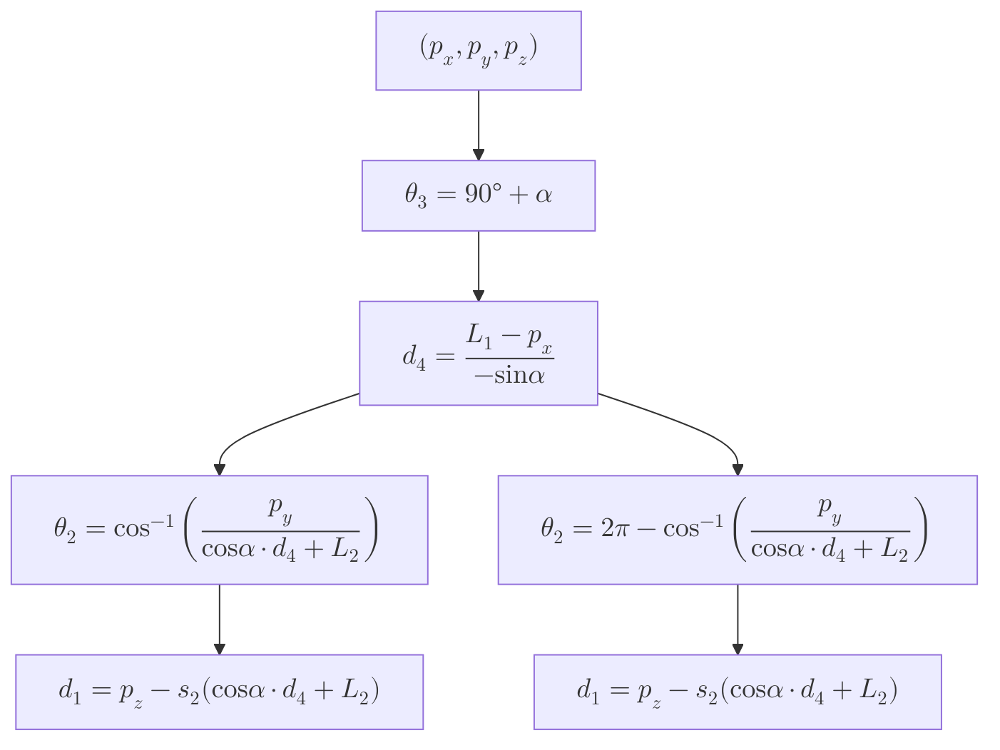
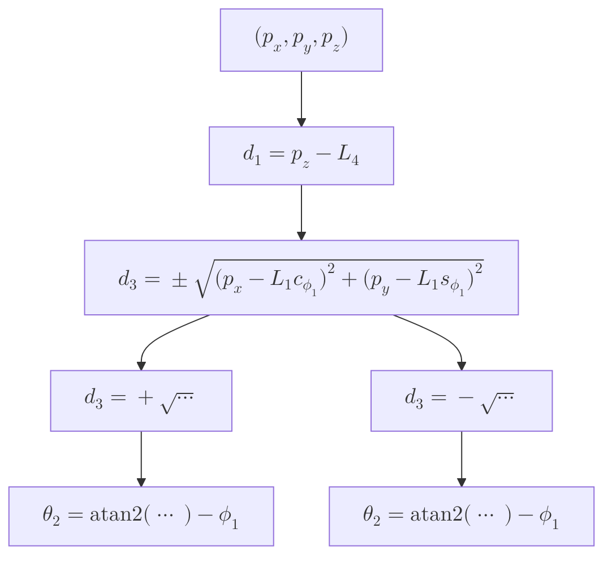
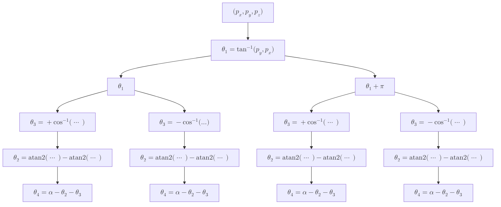

| **Course**        | Introduction to Robotics |
| ----------------- | ------------------------ |
| **Course Number** | 00350001                 |

| סטודנט א'                      | סטודנט ב'                      | סטודנט ג'                        |
| ------------------------------ | ------------------------------ | -------------------------------- |
| עידו פנג בנטוב                 | ניר קרל                        | אופיר רובין                      |
| 322869140                      | 322437203                      | 211544275                        |
| ido.fang@campus.technion.ac.il | nir.karl@campus.technion.ac.il | ofir.rubin@campus.technion.ac.il |

## Question 1

### Part a

From [[IRB1_HW002 תרגיל בית 2#Part a|previous homework]]:

![[IRB1_HW002 תרגיל בית 2 2025-05-09 10.49.07.excalidraw.svg]]^figure-q1-frames
>Assigning all the frames according to the convention.

The D–H Parameters are:
$$\begin{array}{c|cccc}
i & \alpha _{i} & {a}_{i} & {d}_{i} & {\theta}_{i} \\
\hline 1 & 90^{\circ}  & 0 & {d}_{1} & 90^{\circ} \\
2 & 90^{\circ}  & {L}_{2} & {L}_{1} & {\theta}_{2} \\
3 & 90^{\circ}  & 0 & 0 & {\theta}_{3} \\
4 & 0 & 0 & {d}_{4} & 0
\end{array}$$
Which gives us the following forward kinematics:
$$^{0}\mathbf{T}_{4}=\begin{pmatrix}
{s}_{3} & 0 & -{c}_{3} & {L}_{1} - {c}_{3}{d}_{4} \\
{c}_{2}{c}_{3} & {s}_{2} & {c}_{2}{s}_{3} & {L}_{2}{c}_{2} + {c}_{2}{s}_{3}{d}_{4} \\
{s}_{2}{c}_{3} & -{c}_{2} & {s}_{2}{s}_{3} & {L}_{2}{s}_{2} + {d}_{1} + {s}_{2}{s}_{3}{d}_{4} \\
0 & 0 & 0 & 1
\end{pmatrix}$$

Given ${p}_{x}$, ${p}_{y}$ and ${p}_{z}$ we want to move the robot so that:
$$\begin{align}
 & {p}_{x}={L}_{1} - {c}_{3}{d}_{4}\tag{HW3.1} \\[1ex]
 & {p}_{y}={L}_{2}{c}_{2} + {c}_{2}{s}_{3}{d}_{4}\tag{HW3.2} \\[1ex]
 & {p}_{z}={L}_{2}{s}_{2} + {d}_{1} + {s}_{2}{s}_{3}{d}_{4}\tag{HW3.3}
\end{align}$$

We already know that $\boxed{{\theta}_{3}=90°+\alpha }$, where $\alpha$ is a given parameter. Therefore, ${c}_{3} = \cos(90°+\alpha) = -\sin\alpha$ and ${s}_{3} = \sin(90°+\alpha) = \cos\alpha$.

From $\text{(HW3.1)}$, we can find ${d}_{4}$:
$$\boxed {
{d}_{4}=\dfrac{{L}_{1}-{p}_{x}}{{c}_{3}} = \dfrac{{L}_{1}-{p}_{x}}{-\sin\alpha}
 }$$
From $\text{(HW3.2)}$:
$$\begin{gathered}
{c}_{2}=\dfrac{{p}_{y}}{{s}_{3}{d}_{4}+{L}_{2}} = \dfrac{{p}_{y}}{\cos\alpha \cdot {d}_{4}+{L}_{2}}
\end{gathered}$$
Therefore:
$$\boxed {
\begin{gathered}
{\theta}_{2}=\cos^{-1}\left( \dfrac{{p}_{y}}{\cos\alpha \cdot {d}_{4}+{L}_{2}} \right)  \quad 
 \text{ or } \quad 
   {\theta}_{2}=2\pi-\cos^{-1}\left( \dfrac{{p}_{y}}{\cos\alpha \cdot {d}_{4}+{L}_{2}} \right)
\end{gathered}
 }$$
From $\text{(HW3.3)}$:
$$\boxed {
{d}_{1}={p}_{z}-{s}_{2}(\cos\alpha \cdot {d}_{4}+{L}_{2})
 }$$

### Part b
We now know that:
$$\begin{aligned}
 & {L}_{1}=1, &  & \, {L}_{2}=1, \\[1ex]
 & \, {L}_{3}=2, &  & \alpha =\dfrac{\pi}{3}
\end{aligned}$$
If the tool's tip is located at ${P}_{n}=(0,0,{L}_{3})$ in gripper frame coordinates, then the total transformation from world frame coordinates is:
$$\begin{aligned}
^{0}\mathbf{T}_{5} &=  \,^{0}\mathbf{T}_{4}\cdot \;^{4}\mathbf{T}_{5} \\[1ex]
 & =\begin{pmatrix}
{s}_{3} & 0 & -{c}_{3} & {L}_{1} - {c}_{3}{d}_{4} \\
{c}_{2}{c}_{3} & {s}_{2} & {c}_{2}{s}_{3} & {L}_{2}{c}_{2} + {c}_{2}{s}_{3}{d}_{4} \\
{s}_{2}{c}_{3} & -{c}_{2} & {s}_{2}{s}_{3} & {L}_{2}{s}_{2} + {d}_{1} + {s}_{2}{s}_{3}{d}_{4} \\
0 & 0 & 0 & 1
\end{pmatrix} \begin{pmatrix}
1 & 0 & 0 & 0 \\
0 & 1 & 0 & 0 \\
0 & 0 & 1 & {L}_{3} \\
0 & 0 & 0 & 1
\end{pmatrix} \\[1ex]
 & =\begin{pmatrix}
{s}_{3} & 0 & -{c}_{3} & {L}_{1} - {c}_{3}({d}_{4} + {L}_{3}) \\
{c}_{2}{c}_{3} & {s}_{2} & {c}_{2}{s}_{3} & {L}_{2}{c}_{2} + {c}_{2}{s}_{3}({d}_{4} + {L}_{3}) \\
{s}_{2}{c}_{3} & -{c}_{2} & {s}_{2}{s}_{3} & {L}_{2}{s}_{2} + {d}_{1} + {s}_{2}{s}_{3}({d}_{4} + {L}_{3}) \\
0 & 0 & 0 & 1
\end{pmatrix}
\end{aligned}$$
Therefore, when the tool tip is located at ${P}_{0}=(5,0,5)$, then:
$$\begin{align}
 & 5={L}_{1} - {c}_{3}({d}_{4}+{L}_{3})\tag{HW3.4} \\[1ex]
 & 0={L}_{2}{c}_{2} + {c}_{2}{s}_{3}({d}_{4}+{L}_{3})\tag{HW3.5} \\[1ex]
 & 5={L}_{2}{s}_{2} + {d}_{1} + {s}_{2}{s}_{3}({d}_{4}+{L}_{3})\tag{HW3.6}
\end{align}$$
We already know that $\boxed{{\theta}_{3}=90°+\alpha=\frac{5\pi}{6} }$.

Therefore:
$${c}_{3} = \cos\frac{5\pi}{6} = -\frac{\sqrt{3}}{2} \qquad \text{and}\qquad {s}_{3} = \sin\frac{5\pi}{6} = \frac{1}{2}$$

From $\text{(HW3.4)}$:
$$\begin{aligned}
{d}_{4} & =\dfrac{{L}_{1} - 5}{{c}_{3}}-{L}_{3} \\[1ex]
 & =\dfrac{1 - 5}{-\sqrt{3}/2}-2  \\[1ex]
 & =\dfrac{8\sqrt{3}}{3}-2
\end{aligned}$$
Therefore:
$$\boxed{{d}_{4}=\dfrac{8\sqrt{3}}{3}-2}$$

From $\text{(HW3.5)}$:
$$\begin{gathered}
0  ={L}_{2}{c}_{2} + {c}_{2}{s}_{3}({d}_{4}+{L}_{3}) \\[1ex]
0 ={c}_{2}({L}_{2} + {s}_{3}({d}_{4}+{L}_{3})) \\[1ex]
0 ={c}_{2}\left(1 + \frac{1}{2} \cdot \left(\frac{8\sqrt{3}}{3}-2+2\right)\right) \\[1ex]
0 ={c}_{2}\left(1 + \frac{1}{2} \cdot \frac{8\sqrt{3}}{3}\right) \\[1ex]
0 ={c}_{2}\left(1 + \frac{4\sqrt{3}}{3}\right)
\end{gathered}$$

Since $1 + \frac{4\sqrt{3}}{3} \neq 0$, we must have ${c}_{2} = 0$.

Therefore:
$$\boxed{{\theta}_{2}=\frac{\pi}{2} \quad  \text{ or }\quad  {\theta}_{2}=\frac{3\pi}{2}}$$

From $\text{(HW3.6)}$:
$$\begin{aligned}
{d}_{1} & =5-{L}_{2}{s}_{2} - {s}_{2}{s}_{3}({d}_{4}+{L}_{3}) \\[1ex]
 & =5-{s}_{2}({L}_{2} + {s}_{3}({d}_{4}+{L}_{3})) \\[1ex]
 & =5-{s}_{2}\left(1 + \frac{1}{2} \cdot \frac{8\sqrt{3}}{3}\right) \\[1ex]
 & =5-{s}_{2}\left(1 + \frac{4\sqrt{3}}{3}\right)
\end{aligned}$$

Since ${c}_{2} = 0$, we have ${s}_{2} = \pm 1$.

This gives us two solutions:
$$\boxed{\begin{aligned}
{d}_{1} & = \begin{cases}
4 - \frac{4\sqrt{3}}{3} & \text{if } {\theta}_{2}=\pi /2 \\[1ex]
6 + \frac{4\sqrt{3}}{3} & \text{if } {\theta}_{2}=3\pi /2
\end{cases}
\end{aligned}}$$

![[IRB1_HW003 תרגיל בית 3 2025-06-06 11.57.40.excalidraw.svg]]^figure-q1-solution-config
>(Left) Solution where ${\theta}_{2}=\pi /2$. (Right) Solution where ${\theta}_{2}=3\pi /2$.

This manipulator has **2 solutions**:
- **2 solutions** for ${\theta}_{2}$ (elbow-up/elbow-down configurations)

## Question 2
From [[IRB1_HW002 תרגיל בית 2#Part b|previous homework]]:

![[IRB1_HW002 תרגיל בית 2 2025-05-09 13.48.56.excalidraw.svg]]^figure-q2-frames
>Assigning all the frames according to the convention.

The D–H Parameters are:
$$\begin{array}{c|cccc}
i & \alpha _{i} & {a}_{i} & {d}_{i} & {\theta}_{i} \\
\hline 1  & 0  & {L}_{1} & {d}_{1} & {\phi}_{1} \\
2 & 90^{\circ}  & 0 & {L}_{4} & {\theta}_{2} \\
3 & 0 & 0 & {d}_{3} & 0
\end{array}$$
Which gives us the following forward kinematics:
$$^{0}\mathbf{T}_{3}=\begin{pmatrix}
{c}_{{\phi}_{1}+{\theta}_{2}} & 0 & {s}_{{\phi}_{1}+{\theta}_{2}} & {L}_{1}{c}_{{\phi}_{1}}+{d}_{3}{s}_{{\phi}_{1}+{\theta}_{2}} \\
{s}_{{\phi}_{1}+{\theta}_{2}} & 0 & -{c}_{{\phi}_{1}+{\theta}_{2}} & {L}_{1}{s}_{{\phi}_{1}}-{d}_{3}{c}_{{\phi}_{1}+{\theta}_{2}} \\
0 & 1 & 0 & {d}_{1}+{L}_{4} \\
0 & 0 & 0 & 1
\end{pmatrix}$$
Where:
$$\begin{aligned}
 & {\phi}_{1}=\tan^{-1}({L}_{2}/{L}_{3}) \\[1ex]
 & {L}_{1}=\sqrt{ {{{L}_{2}}}^{2}+{{{L}_{3}}}^{2} }
\end{aligned}$$

Given ${p}_{x}$, ${p}_{y}$ and ${p}_{z}$ we want to move the robot so that:
$$\begin{align}
 & {p}_{x}= {L}_{1}{c}_{{\phi}_{1}}+{d}_{3}{s}_{{\phi}_{1}+{\theta}_{2}}\tag{HW3.7} \\[1ex]
 & {p}_{y}={L}_{1}{s}_{{\phi}_{1}}-{d}_{3}{c}_{{\phi}_{1}+{\theta}_{2}}\tag{HW3.8} \\[1ex]
 & {p}_{z}={d}_{1}+{L}_{4}\tag{HW3.9}
\end{align}$$
From $\text{(HW3.9)}$ we can easily see that:
$$\boxed{{d}_{1}={p}_{z}-{L}_{4} }$$

To find the remaining joint variables, we need to solve equations $\text{(HW3.7)}$ and $\text{(HW3.8)}$ for ${\theta}_{2}$ and ${d}_{3}$.

From $\text{(HW3.7)}$ and $\text{(HW3.8)}$:
$$\begin{aligned}
{p}_{x} - {L}_{1}{c}_{{\phi}_{1}} &= {d}_{3}{s}_{{\phi}_{1}+{\theta}_{2}} \\[1ex]
{p}_{y} - {L}_{1}{s}_{{\phi}_{1}} &= -{d}_{3}{c}_{{\phi}_{1}+{\theta}_{2}}
\end{aligned}$$

Squaring both equations and adding them:
$$\begin{gathered}
({p}_{x} - {L}_{1}{c}_{{\phi}_{1}})^{2} + ({p}_{y} - {L}_{1}{s}_{{\phi}_{1}})^{2} = {{{d}_{3}}}^{2}({s}_{{\phi}_{1}+{\theta}_{2}}^{2} + {c}_{{\phi}_{1}+{\theta}_{2}}^{2}) \\[1ex]
({p}_{x} - {L}_{1}{c}_{{\phi}_{1}})^{2} + ({p}_{y} - {L}_{1}{s}_{{\phi}_{1}})^{2} = {{{d}_{3}}}^{2}
\end{gathered}$$

Therefore:
$$\boxed{{d}_{3} = \pm\sqrt{({p}_{x} - {L}_{1}{c}_{{\phi}_{1}})^{2} + ({p}_{y} - {L}_{1}{s}_{{\phi}_{1}})^{2}}}$$

For ${\theta}_{2}$, we can use:
$$\begin{aligned}
{s}_{{\phi}_{1}+{\theta}_{2}} &= \frac{{p}_{x} - {L}_{1}{c}_{{\phi}_{1}}}{{d}_{3}} \\[1ex]
{c}_{{\phi}_{1}+{\theta}_{2}} &= -\frac{{p}_{y} - {L}_{1}{s}_{{\phi}_{1}}}{{d}_{3}}
\end{aligned}$$

Using $\mathrm{atan2}$ for proper quadrant handling:
$${\phi}_{1}+{\theta}_{2} = \mathrm{atan2}\left(\frac{{p}_{x} - {L}_{1}{c}_{{\phi}_{1}}}{{d}_{3}}, -\frac{{p}_{y} - {L}_{1}{s}_{{\phi}_{1}}}{{d}_{3}}\right)$$

$$\boxed{{\theta}_{2} = \mathrm{atan2}\left({p}_{x} - {L}_{1}{c}_{{\phi}_{1}}, -({p}_{y} - {L}_{1}{s}_{{\phi}_{1}})\right) - {\phi}_{1}}$$

This manipulator has **2 solutions**:
- **2 solutions** from the $\pm$ sign in ${d}_{3}$ (forward/backward prismatic motion)

## Question 3
From [[IRB1_HW002 תרגיל בית 2#Part c|previous homework]]:

![[IRB1_HW002 תרגיל בית 2 2025-05-09 14.18.22.excalidraw.svg]]^figure-q3-frames
>Assigning all the frames according to the convention.

The D–H Parameters are:
$$\begin{array}{c|cccc}
i & \alpha _{i} & {a}_{i} & {d}_{i} & {\theta}_{i} \\
\hline 1 & 90^{\circ}  & 0 & {L}_{1} & {\theta}_{1} \\
2 & 0 & {L}_{2} & 0 & {\theta}_{2} \\
3 & 0 & {L}_{3} & 0 & {\theta}_{3} \\
4 & 0 & {L}_{4} & 0 & {\theta}_{4}
\end{array}$$
Which gives us the following forward kinematics:
$$^{0}\mathbf{T}_{4}=\begin{pmatrix}
{c}_{1}{c}_{234} & -{c}_{1}{s}_{234} & {s}_{1} & {c}_{1}{L}_{4}{c}_{234}+{c}_{1}{L}_{3}{c}_{23}+{c}_{1}{c}_{2}{L}_{2} \\
{s}_{1}{c}_{234} & -{s}_{1}{s}_{234} & -{c}_{1} & {s}_{1}{L}_{4}{c}_{234}+{s}_{1}{L}_{3}{c}_{23}+{L}_{2}{s}_{1}{c}_{2} \\
{s}_{234} & {c}_{234} & 0 & {L}_{4}{s}_{234}+{L}_{3}{s}_{23}+{L}_{2}{s}_{2}+{L}_{1} \\
0 & 0 & 0 & 1
\end{pmatrix}$$

Given ${p}_{x}$, ${p}_{y}$ and ${p}_{z}$ we want to move the robot so that:
$$\begin{align}
 & {p}_{x}= {c}_{1}{L}_{4}{c}_{234}+{c}_{1}{L}_{3}{c}_{23}+{c}_{1}{c}_{2}{L}_{2}\tag{HW3.10} \\[1ex]
 & {p}_{y}={s}_{1}{L}_{4}{c}_{234}+{s}_{1}{L}_{3}{c}_{23}+{L}_{2}{s}_{1}{c}_{2}\tag{HW3.11} \\[1ex]
 & {p}_{z}={L}_{4}{s}_{234}+{L}_{3}{s}_{23}+{L}_{2}{s}_{2}+{L}_{1} \tag{HW3.12}
\end{align}$$
We are also given that:
$${\theta}_{2}+{\theta}_{3}+{\theta}_{4}=\alpha \tag{HW3.13}$$

From equations $\text{(HW3.10)}$ and $\text{(HW3.11)}$, we can solve for ${\theta}_{1}$:

Dividing $\text{(HW3.11)}$ by $\text{(HW3.10)}$:
$$\frac{{p}_{y}}{{p}_{x}} = \frac{{s}_{1}{L}_{4}{c}_{234}+{s}_{1}{L}_{3}{c}_{23}+{L}_{2}{s}_{1}{c}_{2}}{{c}_{1}{L}_{4}{c}_{234}+{c}_{1}{L}_{3}{c}_{23}+{c}_{1}{c}_{2}{L}_{2}} = \frac{{s}_{1}}{{c}_{1}} = \tan{\theta}_{1}$$

Therefore:
$$\boxed{{\theta}_{1} = \tan^{-1}({p}_{y}, {p}_{x})}$$

Note that ${\theta}_{1}$ can also be ${\theta}_{1} + \pi$ (pointing in the opposite direction), giving us a second solution branch.

Now, substituting ${\theta}_{1}$ back into equation $\text{(HW3.10)}$:
$$\begin{gathered}
{p}_{x} = {c}_{1}({L}_{4}{c}_{234}+{L}_{3}{c}_{23}+{c}_{2}{L}_{2}) \\[1ex]
\frac{{p}_{x}}{{c}_{1}} = {L}_{4}{c}_{234}+{L}_{3}{c}_{23}+{c}_{2}{L}_{2}
\end{gathered}$$

Let's denote:
$$r = \frac{{p}_{x}}{{c}_{1}} = \sqrt{{{{p}_{x}}}^{2}+{{{p}_{y}}}^{2}}$$

So we have:
$$r = {L}_{4}{c}_{234}+{L}_{3}{c}_{23}+{c}_{2}{L}_{2} \tag{HW3.14}$$

From equation $\text{(HW3.12)}$:
$${p}_{z}-{L}_{1} = {L}_{4}{s}_{234}+{L}_{3}{s}_{23}+{L}_{2}{s}_{2} \tag{HW3.15}$$

Using the constraint ${\theta}_{2}+{\theta}_{3}+{\theta}_{4}=\alpha$, we have ${\theta}_{234} = \alpha$.

From equations $\text{(HW3.14)}$ and $\text{(HW3.15)}$:
$$\begin{gathered}
r = {L}_{4}\cos\alpha +{L}_{3}{c}_{23}+{L}_{2}{c}_{2} \\[1ex]
{p}_{z}-{L}_{1} = {L}_{4}\sin\alpha +{L}_{3}{s}_{23}+{L}_{2}{s}_{2}
\end{gathered}$$

Rearranging:
$$\begin{gathered}
r - {L}_{4}\cos\alpha = {L}_{3}{c}_{23}+{L}_{2}{c}_{2} \\[1ex]
{p}_{z}-{L}_{1} - {L}_{4}\sin\alpha= {L}_{3}{s}_{23}+{L}_{2}{s}_{2}
\end{gathered}$$

Let:
$$\begin{aligned}
A &= r - {L}_{4}\cos\alpha \\[1ex]
B &= {p}_{z}-{L}_{1} - {L}_{4}\sin\alpha
\end{aligned}$$

Then:
$$\begin{aligned}
A &= {L}_{3}{c}_{23}+{L}_{2}{c}_{2} \\[1ex]
B &= {L}_{3}{s}_{23}+{L}_{2}{s}_{2}
\end{aligned}$$

Squaring and adding:
$$A^{2}+B^{2} = {L}_{3}^{2}+{L}_{2}^{2}+2{L}_{2}{L}_{3}\cos{\theta}_{3}$$

Therefore:
$$\begin{gathered}
\cos{\theta}_{3} = \frac{A^{2}+B^{2}-{L}_{2}^{2}-{L}_{3}^{2}}{2{L}_{2}{L}_{3}} \\[1ex]
\boxed{{\theta}_{3} = \pm\cos^{-1}\left(\frac{A^{2}+B^{2}-{L}_{2}^{2}-{L}_{3}^{2}}{2{L}_{2}{L}_{3}}\right)}
\end{gathered}$$

The $\pm$ gives us the **elbow-up** and **elbow-down** configurations.

For ${\theta}_{2}$, we can use:
$$\begin{aligned}
A &= {L}_{3}\cos({\theta}_{2}+{\theta}_{3})+{L}_{2}\cos{\theta}_{2} \\[1ex]
B &= {L}_{3}\sin({\theta}_{2}+{\theta}_{3})+{L}_{2}\sin{\theta}_{2}
\end{aligned}$$
Expanding the trigonometric terms:
$$\begin{aligned}
A &= {L}_{3}(\cos{\theta}_{2}\cos{\theta}_{3} - \sin{\theta}_{2}\sin{\theta}_{3})+{L}_{2}\cos{\theta}_{2} \\[1ex]
&= \cos{\theta}_{2}({L}_{2}+{L}_{3}\cos{\theta}_{3}) - \sin{\theta}_{2}({L}_{3}\sin{\theta}_{3}) \\[2ex]
B &= {L}_{3}(\sin{\theta}_{2}\cos{\theta}_{3} + \cos{\theta}_{2}\sin{\theta}_{3})+{L}_{2}\sin{\theta}_{2} \\[1ex]
&= \sin{\theta}_{2}({L}_{2}+{L}_{3}\cos{\theta}_{3}) + \cos{\theta}_{2}({L}_{3}\sin{\theta}_{3})
\end{aligned}$$

This system can be written in the form:
$$\begin{aligned}
A &= r_{1}\cos{\theta}_{2} - r_{2}\sin{\theta}_{2} \\[1ex]
B &= r_{1}\sin{\theta}_{2} + r_{2}\cos{\theta}_{2}
\end{aligned}$$
where $r_{1} = {L}_{2}+{L}_{3}\cos{\theta}_{3}$ and $r_{2} = {L}_{3}\sin{\theta}_{3}$.

We can express this system as a rotation matrix:
$$\begin{pmatrix} A \\ B \end{pmatrix} = \begin{pmatrix} \cos{\theta}_{2} & -\sin{\theta}_{2} \\ \sin{\theta}_{2} & \cos{\theta}_{2} \end{pmatrix} \begin{pmatrix} r_{1} \\ r_{2} \end{pmatrix}$$

For any vector $\mathbf{v} = (v_x, v_y)$ rotated by angle $\phi$ to give $\mathbf{v}' = (v'_x, v'_y)$:
$$\mathrm{atan2}(v'_y, v'_x) = \mathrm{atan2}(v_y, v_x) + \phi$$

Applying this identity to our system where $(A, B)$ is $(r_1, r_2)$ rotated by ${\theta}_{2}$:
$$\mathrm{atan2}(B,A) =  \mathrm{atan2}(r_{2}, r_{1})+{\theta}_{2}$$

Therefore:
$$\boxed{{\theta}_{2} = \mathrm{atan2}(B,A) - \mathrm{atan2}({L}_{3}\sin{\theta}_{3}, {L}_{2}+{L}_{3}\cos{\theta}_{3})}$$

Finally, from the constraint equation $\text{(HW3.13)}$:
$$\boxed{{\theta}_{4} = \alpha - {\theta}_{2} - {\theta}_{3}}$$

**Total: 4 distinct solutions** (2 × 2 = 4 combinations)

>[!notes] Notes:
>- The solution exists only if $\left|\frac{A^{2}+B^{2}-{L}_{2}^{2}-{L}_{3}^{2}}{2{L}_{2}{L}_{3}}\right| \leq 1$
>- Each solution corresponds to a different robot configuration: (shoulder-left/right) × (elbow-up/down)
