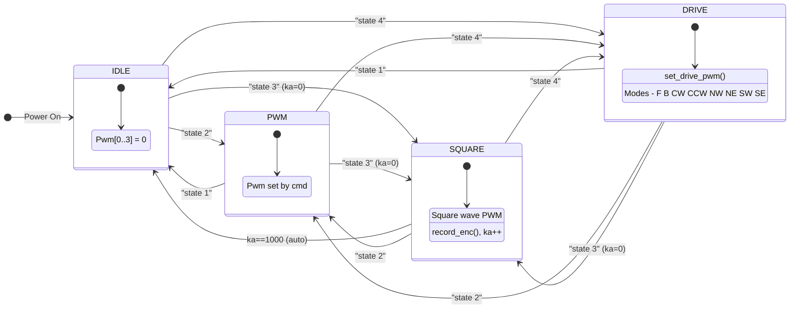

---
aliases:
title: Homework 2
---

| **Course**        | Microprocessor Based Product Design |
| ----------------- | ----------------------------------- |
| **Course Number** | 00340032                            |

| Ido Fang Bentov                | Nir Karl                       |
| ------------------------------ | ------------------------------ |
| 322869140                      | 322437203                      |
| ido.fang@campus.technion.ac.il | nir.karl@campus.technion.ac.il |

Station Number: **8**

# Brief Overview

This lab involves programming an STM32G4 microcontroller to control a Mecanum-wheeled cart with 4 DC motors. The system implements a state machine with multiple operating modes, allowing the user to control the cart via UART commands from either PuTTY or a MATLAB GUI. The program runs a $\pu {100 Hz }$ timer interrupt for real-time control and includes functionality to record encoder data during a square-wave PWM test for motor characterization.

# Algorithm Description

The program operates as a state machine with four main states. On each timer interrupt ($\pu {100 Hz }$), the current state determines the behavior:

1. **STATE_IDLE:** All PWM outputs are set to zero. The cart remains stationary.
2. **STATE_PWM:** The PWM values are directly controlled by user commands. This allows manual testing of individual motor responses.
3. **STATE_SQUARE:** A square-wave PWM signal is applied to all motors simultaneously. The encoder readings and PWM values are recorded into a buffer for later analysis.
4. **STATE_DRIVE:** The cart responds to drive mode commands, enabling motion in 8 directions using Mecanum wheel kinematics.

The UART handler (`handle_comm`) parses incoming commands and updates global variables accordingly. The timer callback (`HAL_TIM_PeriodElapsedCallback`) executes the appropriate logic based on the current state.

# State Machine

>State machine diagram showing the four operating states, their internal actions, and transitions triggered by UART commands.

**State Transitions:**
- Transitions between states are triggered by the `state xx` UART command, where `xx` is the state number (1-4).
- When entering STATE_SQUARE, the recording index `ka` is reset to 0.
- STATE_SQUARE automatically transitions to STATE_IDLE after recording NP=1000 samples.
- Within STATE_DRIVE, the `mode xx` command selects the drive direction without changing the state.

# Mecanum Wheel Kinematics

The cart uses Mecanum wheels positioned as follows:
- Motor 1: South-East (SE)
- Motor 2: South-West (SW)
- Motor 3: North-West (NW)
- Motor 4: North-East (NE)

The `set_drive_pwm` function calculates the required PWM for each wheel based on the selected drive mode. For diagonal motion (NW, NE, SW, SE), only two wheels are driven while the others remain idle, exploiting the Mecanum wheel's ability to generate lateral forces.

| Mode     | SE (1) | SW (2) | NW (3) | NE (4) |
| -------- | ------ | ------ | ------ | ------ |
| Forward  | +      | +      | +      | +      |
| Backward | −      | −      | −      | −      |
| CW       | −      | +      | +      | −      |
| CCW      | +      | −      | −      | +      |
| NW       | 0      | +      | 0      | +      |
| SE       | 0      | −      | 0      | −      |
| NE       | +      | 0      | +      | 0      |
| SW       | −      | 0      | −      | 0      |

# UART Command Interface

The system accepts commands via UART at 115200 baud rate. The `apply_command` function processes four command types:

1. **`state xx`** — Sets the operating state (1=IDLE, 2=PWM, 3=SQUARE, 4=DRIVE).
2. **`pwm d1 d2 d3 d4`** — Sets individual PWM values for each motor (range: −9999 to 9999).
3. **`mode xx`** — Sets the drive direction in STATE_DRIVE (1=F, 2=B, 3=CW, 4=CCW, 5=NW, 6=SW, 7=NE, 8=SE).
4. **`send`** — Transmits the recorded encoder data (10000 bytes) to the host.

# MATLAB Interface

Two MATLAB scripts provide user interfaces:

**ui.m** — A graphical interface with a 3×3 button grid for directional control. Buttons send the appropriate `state` and `mode` commands via serial. The COM port is automatically detected using `find_com`.

**record.m** — Automates the recording process:
1. Sends `state 3` to start the square-wave test.
2. Waits for recording completion (~10 seconds).
3. Sends `send` to retrieve the recorded data.
4. Parses the binary data and calculates angular velocity from encoder differences.
5. Saves the data to `record_data.mat` and generates plots.

**plot_record.m** — Regenerates plots from saved data (no robot connection needed). Loads `record_data.mat` and generates angular velocity vs. time and input voltage vs. time plots.

![[Pasted image 20251222180403.png|600]]^figure-uart-matlab-interface
>UART MATLAB Interface.

# Motor Characterization Results

The following figures show the results of the square-wave PWM test, where all four motors were driven with alternating positive and negative PWM values while recording encoder readings.

![[omega_vs_time.png|bookhue|600]]^figure-omega-vs-time
>Angular velocity vs. time for each wheel.

![[voltage_vs_time.png|bookhue|600]]^figure-voltage-vs-time
>Input voltage vs. time (square wave pattern applied to all motors).

