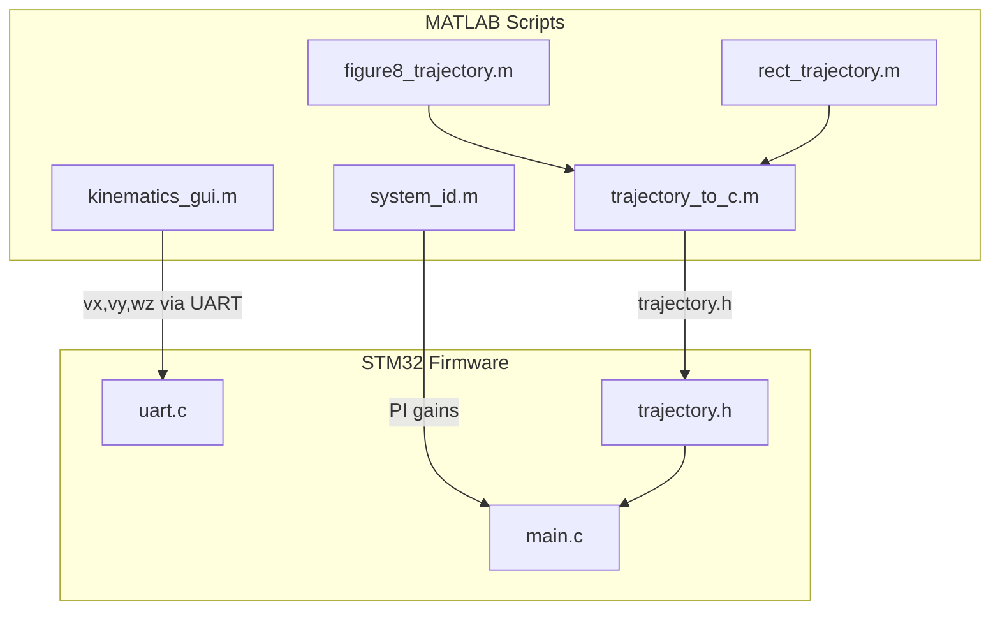

# MCP1 Lab 2 Part 2 Implementation Plan

This plan covers all 4 assignments: SISO velocity control, cart kinematics control, trajectory following, and obstacle avoidance.

## Architecture Overview




## 1. STM32 Firmware Updates

### New States and Modes in [`main.h`](content/Technion/MCP1/MCP1_HW002P2/HW002P2_code/Core/Inc/main.h)

- Add `STATE_VELOCITY` (5) - velocity reference mode with PI control
- Add `STATE_KINEMATICS` (6) - vx/vy/wz control mode
- Add `STATE_TRAJECTORY` (7) - trajectory following with output compare

### PI Velocity Controller in [`main.c`](content/Technion/MCP1/MCP1_HW002P2/HW002P2_code/Core/Src/main.c)

Implement incremental PI controller based on the provided reference:

```c
// Error calculation: E[q] = Ref[q] - We[q]  (reference - measured velocity)
// Incremental PI: du = ki*E[q] + kp*(E[q]-E1[q])
// Control output: U[q] += du (with saturation)
```

Default PI gains: `kp=12.0`, `ki=0.15` (from given `main_with_PI.c`)

### Mecanum Kinematics Implementation

Inverse kinematics to convert (vx, vy, wz) to wheel velocities:

```c
// Wheel layout: FL, FR, RL, RR
// omega_FL = (vx - vy - (L+W)*wz) / r
// omega_FR = (vx + vy + (L+W)*wz) / r
// omega_RL = (vx + vy - (L+W)*wz) / r
// omega_RR = (vx - vy + (L+W)*wz) / r
```


### Trajectory Following with Output Compare

- Use TIM5 for variable timing between trajectory points
- Store trajectory as `vt[]` (velocities) and `tt_clk[]` (timing in clock counts)
- Trigger output compare interrupt to advance to next trajectory point

### Obstacle Detection

- Read proximity sensor on PA7
- In trajectory mode: stop motors when obstacle detected
- Optional: implement bypass maneuver for bonus

### UART Command Extensions in [`uart.c`](content/Technion/MCP1/MCP1_HW002P2/HW002P2_code/Core/Src/uart.c)

- `vel vx vy wz` - Set cart velocity in kinematics mode
- `ref r0 r1 r2 r3` - Set individual wheel velocity references (rad/s scaled)
- `gains kp ki` - Set PI controller gains
- `traj start` - Start trajectory execution
- `traj stop` - Stop trajectory execution

## 2. MATLAB Scripts for [`p2`](content/Technion/MCP1/MCP1_HW002P2/HW002P2_code/MATLAB/p2)

### Helper Scripts

- `find_com.m` - COM port auto-detection (copy from p1 or p2-given)
- `sendcmd.m` - Serial command wrapper (adapt from p2-given)

### Controller Design: `system_id.m`

- Load recorded data from Part 1 (`record_data.mat`)
- Fit first-order model (DC motor dynamics)
- Design PI controller with specified rise time (~0.15s)
- Generate step response comparison plots
- Output: PI gains for firmware

### Kinematics Control: `kinematics_gui.m`

- GUI with sliders/inputs for vx, vy, wz
- Real-time UART transmission
- Buttons for predefined motions (test cases from assignment)

### Trajectory Generation

1. **`figure8_trajectory.m`** - Generate figure-8 path

- Parametric equations: x = A*sin(t), y = A*sin(t)*cos(t)
- Compute curvature-based speed profile
- Export to C header format

2. **`rect_trajectory.m`** - Interactive rectangle path

- Use `ginput` for corner selection
- Fit spline through points using `catmullRomSplineFit1.m`
- Generate adaptive timing based on curvature

3. **`trajectory_to_c.m`** - Common export utility

- Convert MATLAB trajectory to `trajectory.h` header
- Format as `const int16_t vt[]` and `const uint32_t tt_clk[]`

## 3. Report Structure

Following the format from [`MCP1_HW002P1`](content/Technion/MCP1/MCP1_HW002P1%20Homework%202%20Part%201.md):

- Brief Overview
- Algorithm Description
- State Machine Diagram
- Results plots (step responses, trajectory following)
- UART Command Interface table

## Key Files to Create/Modify